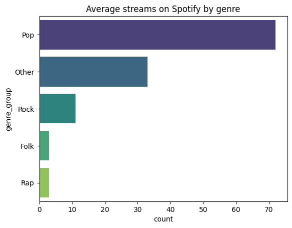
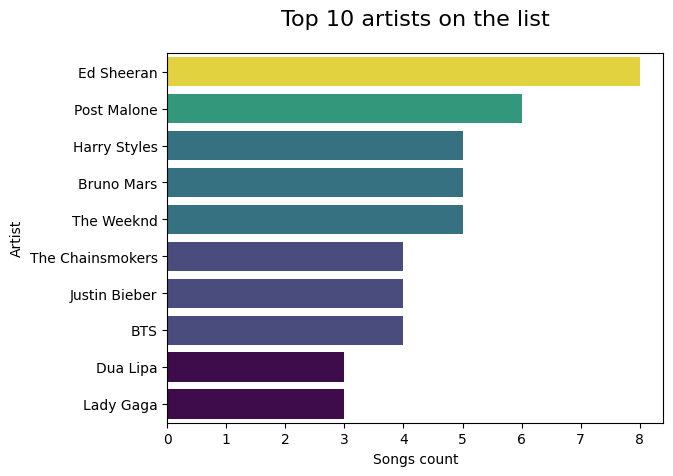

# Spotify Top Songs Analysis (EDA)

## Overview

This project presents an exploratory data analysis of the *spotify_alltime_songs* dataset, which contains information on the 100 most streamed songs on Spotify. The analysis focuses on identifying patterns and characteristics associated with highly streamed tracks.

The goal is not to predict success, but to understand what features are commonly observed among top-performing songs and how different factors interact.

---

## Objective

The main objective of this analysis is to explore factors associated with high streaming numbers on Spotify, including:

* Genre distribution
* Release year trends
* Explicit content
* Artist and country representation

---

## Key Questions

* Do certain genres have higher representation among top-streamed songs?
* Are newer songs more dominant on streaming platforms?
* Does explicit content influence song popularity?
* Is song popularity concentrated among a small group of artists?
* How are genre and artist origin (country) related?

---

## Dataset

* **Source:** [Kaggle Dataset](https://www.kaggle.com/datasets/emanfatima2/spotify-global-hits-and-artist-analytics)
* **Size:** 100 records
* **Features include:**

  * Song title
  * Artist
  * Release year
  * Genre
  * Explicit content flag
  * Artist country

---

## Data Preparation

* Handled genre inconsistencies by grouping sub-genres into broader categories (e.g., Pop, Rap, Rock)
* Split and expanded multi-artist records using column “explosion” for country-level analysis
* Ensured consistency in categorical variables (e.g., trimming whitespace)

---

## Key Findings

* The dataset is heavily skewed toward recent songs, likely reflecting the growth of streaming platforms starting around 2015.

* Pop is the dominant genre and plays a central role in overall streaming patterns.

* US artists account for the majority of songs, highlighting the global influence of the American music industry.

* There is a strong relationship between US artists and Pop music, with Pop being the most common genre among US performers.

* Explicit content is not a defining characteristic of highly streamed songs and appears to be influenced more by genre than by popularity itself.

* Song representation is concentrated among a relatively small group of artists, with the top 5 artists accounting for nearly 19% of all songs in the dataset.

---

## Sample Visualizations

### Genre distribution



### Top artists




## Key Analytical Insight

A key finding of this analysis is the importance of comparing proportions rather than raw counts.

For example, while US artists account for the highest number of explicit songs, the proportion of explicit tracks is similar to that of Canadian artists. This demonstrates that differences in totals can be driven by representation rather than underlying behavior.

---

## Limitations

* The dataset contains only 100 songs, limiting generalizability
* It includes only top-streamed tracks, introducing selection bias
* Some analyses rely on exploded data (multiple artists per song), which affects counts
* External factors such as marketing, playlist placement, and listener behavior are not included

---

## Tools Used

* Python
* pandas
* matplotlib / seaborn
* Jupyter Notebook

---

## Project Structure

```
spotify-analysis/
│
├── spotify-hits-analysis.ipynb
├── spotify_alltime_songs.csv
└── README.md
```
